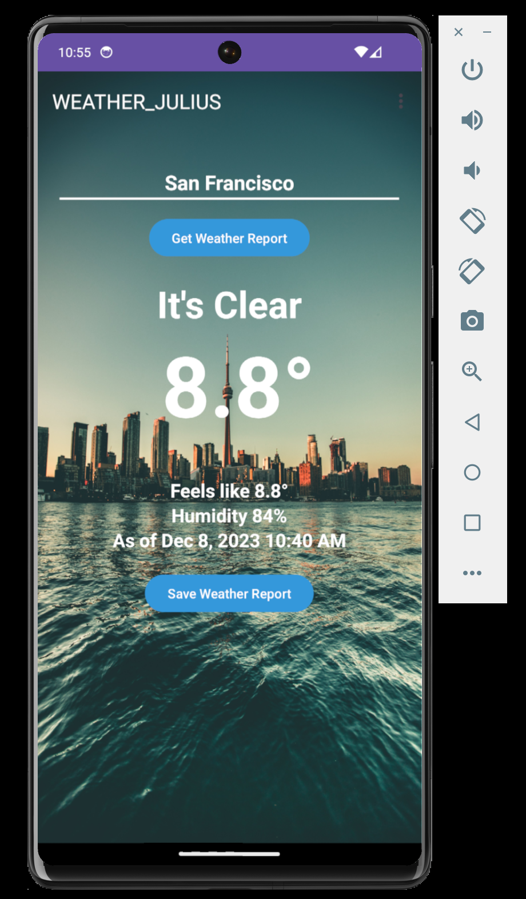
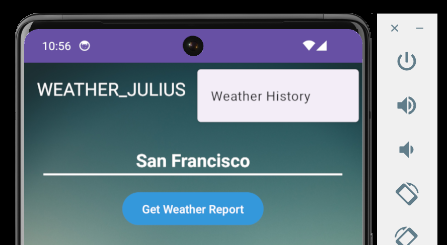

# weather-app

Showcasing what I learned about building Android Application    

## How it is made
- android jetpack app architectured
- uses third party API to fetch weather (https://www.visualcrossing.com/) using Retrofit and Mushi
- uses Recycler view to display
- uses ConstraintLayout
- uses View binding
- uses Room and SQLite to store the data
  
## Features
- Enter the address or city in the EditText
- Getting the Weather Report
- Saving the Weather Report
- Navigating to the Weather History Report

## Screenshots

